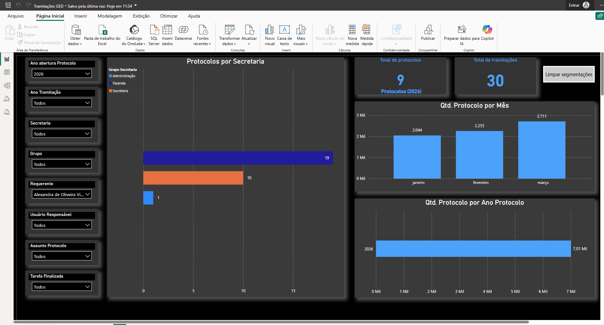

# Dashboard de Tramitações Públicas - Power BI

## Objetivo
Analisar o volume de protocolos e tramitações em diferentes secretarias, identificando padrões, crescimento e distribuição.

---

## Problema
Os dados apresentavam inconsistências como:
- Datas em formatos inválidos
- Valores nulos
- Tipos de dados inconsistentes
- Arquivos inválidos na ingestão (ex: .pbix na pasta)

---

## Solução
Foi desenvolvido um pipeline de dados com:

- Ingestão de múltiplos arquivos Excel
- Tratamento com Power Query
- Modelagem de dados (dimensão e fato)
- Criação de medidas com DAX
- Dashboard interativo

---

## Tecnologias
- Power BI
- Power Query (M)
- DAX

---

## Dashboard

---

## Insights
- Crescimento contínuo no volume de protocolos
- Pico em 2025
- 2026 com dados parciais
- Concentração em algumas secretarias

## Autor: Manoel Alexandre
